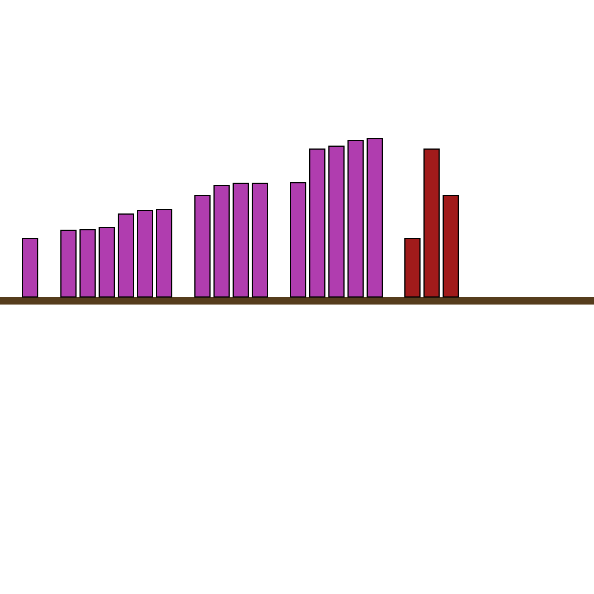
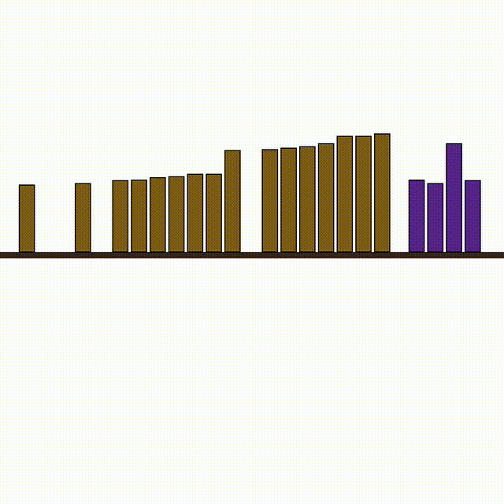
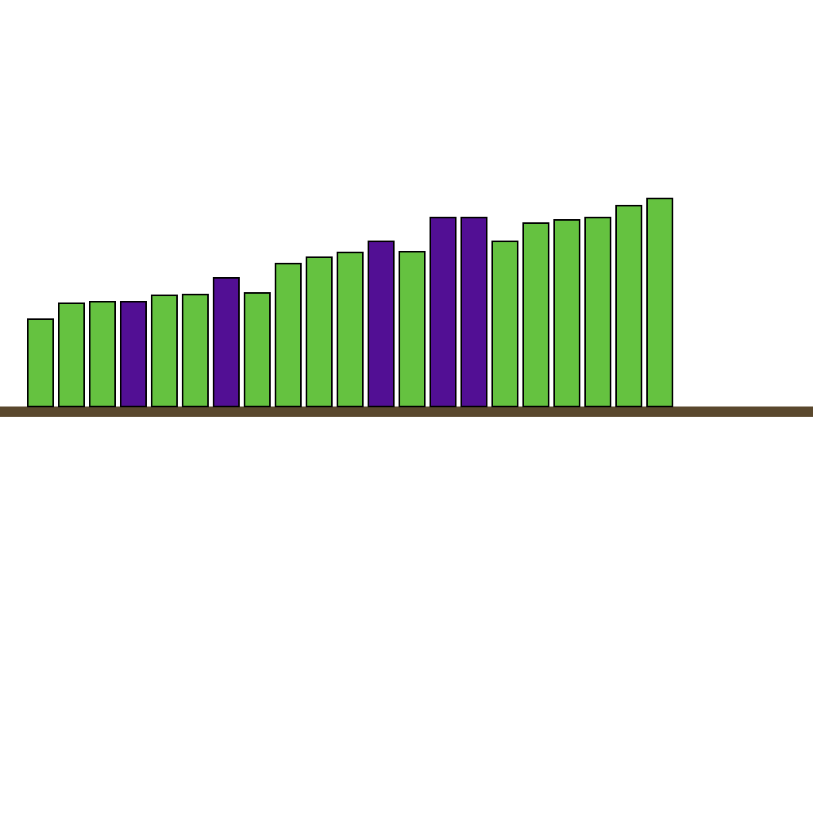

# O-30: Bookshelf Insertion Data Generator

Generates synthetic reasoning tasks where books need to be inserted into a bookshelf based on height matching. The task requires determining the optimal gap for each book by comparing heights with surrounding books on the shelf.

Each sample pairs a **task** (first frame + prompt describing what needs to happen) with its **ground truth solution** (final frame showing the result + video demonstrating how to achieve it). This structure enables both model evaluation and training.

---

## 📌 Basic Information

| Property | Value |
|----------|-------|
| **Task ID** | O-30 |
| **Task** | Bookshelf Insertion |
| **Category** | Abstraction |
| **Resolution** | 1024×1024 px |
| **FPS** | 16 fps |
| **Duration** | Variable |
| **Output** | PNG images + MP4 video |

---

## 🚀 Usage

### Installation

```bash
# Clone the repository
git clone https://github.com/VBVR-DataFactory/O-30_bookshelf_data-generator.git
cd O-30_bookshelf_data-generator

# Install dependencies
pip install -r requirements.txt
```

### Generate Data

```bash
# Generate 100 samples
python examples/generate.py --num-samples 100

# Generate with specific seed
python examples/generate.py --num-samples 100 --seed 42

# Generate without videos
python examples/generate.py --num-samples 100 --no-videos

# Custom output directory
python examples/generate.py --num-samples 100 --output data/my_output
```

### Command-Line Options

| Argument | Type | Description | Default |
|----------|------|-------------|---------|
| `--num-samples` | int | Number of samples to generate | 100 |
| `--seed` | int | Random seed for reproducibility | Random |
| `--output` | str | Output directory | data |
| `--no-videos` | flag | Skip video generation | False |

---

## 📖 Task Example

### Prompt

```
In the scene, there is a bookshelf with a set of books already placed, and a few red books waiting on the right. There are gaps between the books on the shelf. Place each red book into a gap where its height is closest to the surrounding books. Show the insertion process step by step.
```
### Visual

<table>
<tr>
  <td align="center"></td>
  <td align="center"></td>
  <td align="center"></td>
</tr>
<tr>
  <td align="center"><b>Initial Frame</b><br/>Books on shelf with gaps, new books waiting</td>
  <td align="center"><b>Animation</b><br/>Books inserted into matching gaps</td>
  <td align="center"><b>Final Frame</b><br/>All books inserted into optimal positions</td>
</tr>
</table>

---

## 📖 Task Description

### Objective

Insert new books into gaps on a bookshelf by finding the optimal position for each book based on height matching with surrounding books.

### Task Setup

- **Existing Books**: Blue books already placed on the shelf with gaps between them
- **Books to Insert**: Red/colored books waiting on the right side
- **Height Clustering**: Books form height-based clusters (adjacent books with similar heights)
- **Book Count**: 16 blue books on shelf, 3 red books to insert (varies 2-5)
- **Height Range**: Books range from 50 to 200 pixels in height
- **Clustering Threshold**: Auto-calculated based on median height differences

### Key Features

- **Height-based matching**: Tests ability to compare and match heights visually
- **Spatial reasoning**: Requires understanding of gaps and positioning
- **Optimal assignment**: May need to evaluate multiple possible placements
- **Sequential insertion**: Books inserted one by one in optimal order
- **Visual clustering**: Recognizing groups of books with similar heights
- **Gap identification**: Finding and evaluating available insertion positions
- **Pattern completion**: Inserting books to complete visual height patterns

---

## 📦 Data Format

```
data/questions/bookshelf_insertion_task/bookshelf_insertion_00000000/
├── first_frame.png      # Initial state (books on shelf with gaps)
├── final_frame.png      # Final state (all books inserted)
├── prompt.txt           # Task instructions
├── ground_truth.mp4     # Solution video (16 fps)
└── question_metadata.json # Task metadata
```


**File specifications**: Images are 1024×1024 PNG. Videos are MP4 at 16 fps, variable duration based on number of insertions.

---

## 🏷️ Tags

`spatial-reasoning` `height-matching` `pattern-completion` `clustering` `optimal-placement` `visual-comparison` `sequential-planning`

---
